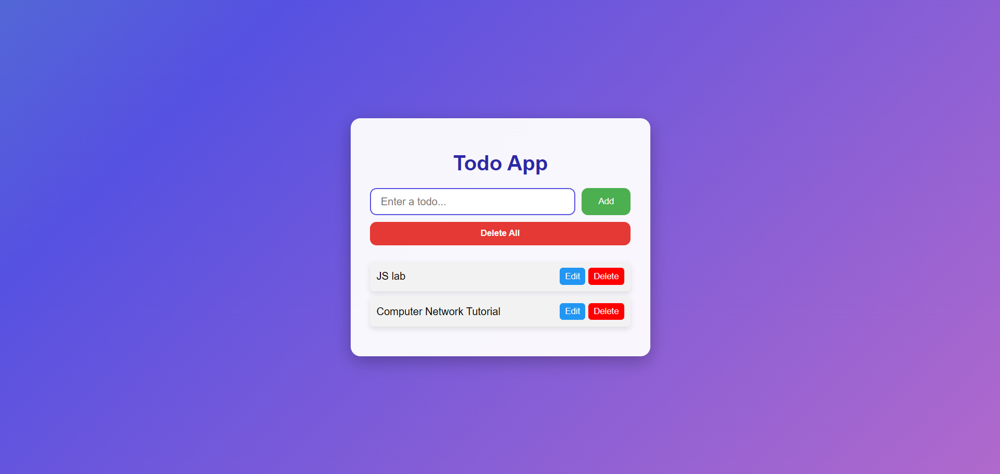
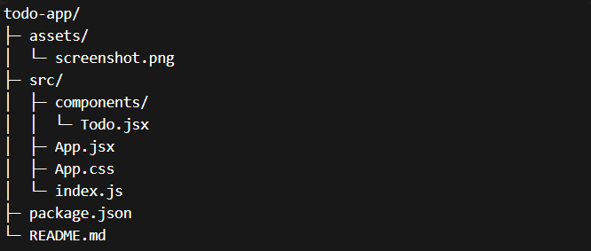

# 📝 Todo App – React Version 5
A modern **Todo App** built with **React** that allows you to **add, edit, delete, and delete all todos**, with data **persisted in LocalStorage**. The app features a **beautiful animated gradient background**, responsive buttons, and a clean user interface.

## Features
- Add a new todo  
- Edit existing todos  
- Delete individual todos  
- Delete all todos at once  
- Todos are saved in **LocalStorage** (data persists after refresh)  
- Modern UI with animated gradient background and polished buttons  

## Demo Screenshot

## Technologies Used
- React (Functional Components & Hooks)  
- LocalStorage API  
- CSS3 (Animated Gradient Background & Modern Buttons)  

## Project Structure

## Getting Started
1. Clone the repository: `git clone <your-repo-url>` and `cd todo-app`  
2. Install dependencies: `npm install`  
3. Start the app: `npm start`  
- The app will run on [http://localhost:3000](http://localhost:3000)  

## Usage
1. Type a todo in the input box  
2. Click **Add** to add a new todo  
3. Click **Edit** to modify a todo  
4. Click **Delete** to remove a single todo  
5. Click **Delete All** to remove all todos  

## Commit History for Versioning
- Version 1: Basic add functionality  
- Version 2: Add & delete individual todos  
- Version 3: Edit todo functionality added  
- Version 4: Persist todos using LocalStorage  
- Version 5: Modern UI, Delete All button, styled buttons  
